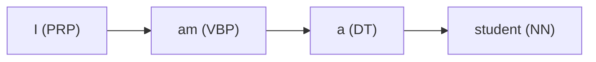

# The AI Study Diary

[English](./README_en.md)

## 개요

이 리포지토리는 Python과 PyTorch를 사용하여 머신러닝의 기초를 학습하며 사용한 코드와 개념을 기록합니다.
GPU의 텐서 작업, SVM(Support Vector Machines)과 같은 기계 학습, 로지스틱 회귀, PCA, DBSCAN, 이미지 분류와 같은 작업을 위해
PyTorch를 사용해 코드를 작성합니다. 수업 기록이므로, 목차에 대해 모든 코드가 포함되어 있지 않을 수 있습니다.


<details>
    <summary><b>Day 1 - 2023-09-04</b></summary>

- OOP 기본 개념
    - 스페셜 메소드
    - `super()` 및 클래스 상속

#### 스칼라? 벡터? 텐서?

- Scala [x]
- Vector [x, y]
- Tensor [x, y, ...z]

#### GPU에서의 PyTorch

```python
import torch

# !!! Before !!!
print(torch.cuda.is_available())  # 참이여야 합니다.

# cuda:n 형식으로 작성합니다. n은 GPU의 인덱스 번호입니다.
ex = torch.tensor([[1, 2], [3, 4]], device="cuda:0")
res = ex.to("cpu").numpy()
print(res)
```

#### Shape 조작하기

```python
import torch

a = torch.tensor([[1, 2, 3, 4], [5, 6, 7, 8]], dtype=torch.int8)
b = torch.tensor([[1, 2, 3, 4], [5, 6, 7, 8]], dtype=torch.int8)

c = a + b

print(c.shape)
print(c.view(8, 1))
print(c.view(1, 8))
```

</details>

#### Advanced Python and Tensor

---

<details>
    <summary><b>Day 2 - 2023-09-05</b></summary>


---
### 코드 목차
- Numpy
    - 배열
    - 인덱싱
    - 배열을 텐서로 변환하기
- Pandas
- Matplotlib
- 자동차 평가 데이터 세트 (w. PyTorch)
    - Data
        - Preprocessing
        - Visualization
    - Model
        - Training
        - Evaluation

</details>

#### Handing car evaluation dataset train/eval and visualize

---
<details>
    <summary><b>Day 3 - 2023-09-06</b></summary>

- Pandas
    - 데이터프레임
- 기본적인 머신러닝 개념 복습하기
- 서포트 벡터 머신 `(SVM)`
- `비선형`과 `선형 분류`
- `로지스틱 회귀`를 사용한 숫자 예측
- `혼동 행렬`에 대하여

*선형 분류*는 *비선형 분류*보다 빠르지만, 만약 데이터가 선형적으로 분포되어 있지 않다면, 선형 회귀는 사용될 수 없습니다.
이 경우, *비선형 회귀*를 사용해야만 합니다.

> 키워드 :  
> KNN, SVN, 결정트리, 선형희귀, 로지스틱 회귀
>
> ex) 비지도 학습이 아닌것은?

- DBSCAN / PCA
    - 밀도 기반으로 군집을 분석하고 시각화 후 하이퍼 파라미터를 변경하여 나타나는 현상 확인
        - 하이퍼 파라미터를 큰 폭으로 변경하니 클러스터의 많은 부분이 무시됨
    - 차원이 축소된 데이터 핸들링
    - 범례 및 기타 matplotlib 구성

</details>

#### SVM, Logistic Regression, Confusion Matrix

---
<details>
    <summary><b>Day 4 - 2023-09-07</b></summary>

### 간단 머신러닝 개념
- 지도
    - KNN
        - 입력된 값이 훈련된 값의 집합과 인접한지 비교함
    - SVM
        - 데이터의 집합 사이에 선을 그어 구분하는데 선의 margin을
          gamma과 c(cost)를 조절하여 결정함.
    - 결정트리
    - 회귀
        - Iris 꽃의 종류, 타이타닉 생존자 등
    - 선형 회귀
        - 말그대로 선만 긋기떄문에 속도가 빠르지만 정확도가 떨어짐
    - 로지스틱 회귀
        - 곡선을 그릴 수 있으며, 당연히 속도가 느려지고 정확도가 비교적 높음
- 비지도
    - 계층 군집화(Hierarchical Clustering)
        - 개별 개체들을 하나의 클러스터로 보고, 가까운 클러스터끼리 합치면서 클러스터의 개수를 줄여 나가는 방식입니다.
    - DBSCAN
        - 밀도 기반의 군집화 알고리즘으로, 밀도가 높은 부분을 클러스터로 인식합니다.
    - PCA (Principal Component Analysis)
        - 다차원의 데이터를 시각화하거나 차원을 축소할 때 주로 사용되는 비지도학습 방법입니다.
### CNN, DNN 코드 코멘트
- 'FashionMNIST'을 처리하는 CNN과 DNN 모델 작성, 각 epoch당 진행 상황 (iteraction, loss, accuracy)을 출력시켜 학습 과정을 확인.
- CNN은 데이터가 약간만 달라져도 정확도가 떨어지기에 의미가 없음.
- DNN은 데이터가 달라져도 정확도가 높은 편임.
하지만 학습 데이터에 한해선 CNN과 DNN 모두 iteration이 2만까지 늘어나도 정확도는 비슷했음 (CNN 89%, DNN 90%)

### 전이학습 - Transfer Learning

- 미리 학습된 모델을 가져와서 사용함.
- 데이터셋을 불러와 `전처리 -> 모델 불러오기 -> 최적화/손실 함수 선언 -> 추가 학습 -> 테스트` 과정을 거쳐 모델을 추가학습 시키는 코드를 작성함.
- 테스트를 거쳐 예측 결과를 기반으로 손실을 계삲고 최적화 과정을 거쳐 epoch를 반복함.
    - 최고의 정확도를 가지는 모델을 저장함.
</details>

#### Hierarchical Clustering, DBSCAN, PCA

---


<details>
    <summary><b>Day 5 - 2023-09-11</b></summary>

# 사전훈련된 ResNet 모델을 사용하여 이미지 분류하기

### 왜 주피터가 필요한가요?

- 주피터는 IPython (Interactive Python) 기반입니다.
- 기본적으로, 한번 실행된 파이썬 스크립트는 실행이 끝나면 사라집니다.
- 주피터를 사용하면 파이썬 스크립트의 출력을 유지하고 나중에 다시 실행할 수 있습니다. (메모리에 유지)
- 머신 러닝 코드는 보통 한 함수 호출로 인해 많은 시간을 소모합니다.
    - 따라서, 함수의 출력을 저장하여 시간을 아낄 수 있게 됩니다.

### 사전 훈련된 ResNet 모델을 사용한 고양이와 개 분류

- 훈련 데이터로부터 고양이와 개 이미지를 로드합니다.
- 이미지 분류를 위해 사전 훈련된 ResNet 모델을 활용합니다.
- 효율성을 높이기 위해 데이터셋에 변형을 적용합니다.
- 모델의 마지막 층을 두 클래스(고양이와 개)에 맞게 커스터마이징합니다.
- 주어진 에포크 수 동안 데이터셋을 반복하는 사용자 정의 훈련 함수 `train_model`을 정의합니다.
- `train_model` 내에서, 계산된 손실에 기초하여 모델 가중치를 조정하고 최상의 모델 상태를 추적합니다.
- 나중에 사용할 수 있도록 최상의 모델 상태를 저장합니다.

### 저장된 모델을 사용한 이미지 평가

- 훈련 과정 후에는 `eval_model()` 함수를 사용하여 테스트 데이터 세트에 대한 모델 성능을 평가합니다.
- 훈련 중에 저장된 모든 모델을 로드하고 모델의 예측 정확도를 평가합니다.
- 정확도가 가장 높은 모델을 식별하여 저장합니다.

</details>

#### Image Classification Using Pretrained ResNet Model

---

<details>
    <summary><b>Day 6 - 2023-09-12</b></summary>

- 모든 이미지를 정규화하는 `ImageTransform` 유틸리티 클래스를 사용하여 사진의 크기를 일괄되게 변경하고, 학습(train)과 검증(vaild) 데이터를 분리합니다.
    - 데이터의 방향에 과적합 되지 않도록 이미지의 절반을 뒤집어서 학습 데이터를 늘립니다.
        - 검증 과정에선 회전이 필요 없으므로 `RandomHorizeontalFlip()`을 사용하지 않습니다.
- 학습 데이터가 너무 많으므로 400개의 사진만 학습용으로 사용합니다.
- 불러오는 과정에서 `os.path.join()` 함수를 사용하여 경로를 합쳐 정확하게 불러옵니다.
- 데이터셋을 불러오는 코드 중 `cv2.cvtColor(img, cv2.COLOR_BGR2RGB)` 라는 코드는 OpenCV가 RGB가 아닌 BGR 값을 사용하기 때문에 색상을 변환하기 위한 과정입니다. (책의
  예제에서 `cv2`로 이미지를 불러오기에 따라했지만 효율적이지 못한 방법입니다.)
- 라벨의 이름을 학습 데이터 폴더의 하위 디렉토리 이름으로 설정합니다.
    - 이 과정에서 운영체제에 따라 separator가 다르므로 `os.path.sep`을 사용합니다.
        - `abel = img_path.split(path.sep)[-len(path.sep)].split('.')[0]`
- 학습 결과, 정확도가 높진 않지만 유의미한 결과를 보여주었습니다.

</details>

#### Is it a cat or a dog? (ResNet)

---

<details>
    <summary><b>Day 7 - 2023-09-20</b></summary>

### 개요
오늘은 좀 더 다양한 종류의 데이터셋을 다루기 위해 순환 신경망(RNN)에 대해 학습하였습니다.  
시계열, RNN의 기본, Long Short-Term Memory (LSTM) 그리고 Gated Recurret Units (GRU)에 대해 다룹니다.  

### 시계열 문제
- AR 모델
  - 자기 자신의 과거를 사용하여 미래를 예측하는 모델
- MA 모델
  - 자기 자신의 과거 오차를 사용하여 미래를 예측하는 모델
- ARMA 모델
  - AR과 MA 모델을 합친 모델
- ARIMA 모델  <-- 이걸로 예측을 진행 = ~~똥이였음~~
  - ARMA 모델에 추세를 예측하는 모델

### RNN
기본 RNN 셸은 'X', 이전 은닉 상태 'h'를 받아 '0'과 다음 은닉 상태 'h'를 출력합니다.
```python
class BasicRNNCell(nn.Module):
    def __init__(self, input_size, hidden_size, output_size):
        super(RNNCell, self).__init__()
        self.hidden_size = hidden_size
        self.i2h = nn.Linear(input_size + hidden_size, hidden_size)
        self.i2o = nn.Linear(input_size + hidden_size, output_size)
        
    
    def forward(self, input_, hidden):
        combined = torch.cat((input_, hidden), 1)
        hidden = self.i2h(combined)
        output = self.i2o(combined)
        return output, hidden
    
    def initHidden(self):
        return torch.zeros(1, self.hidden_size)
```

### LSTM
LSTM은 RNN 셸과 비슷하게 생겼지만 다음 셸로 전달되는 "셸 상태"로 다음 은닉 상태를 관리합니다.  
기존 RNN과의 차이는 셸 상태가 네트워크가 상태를 업데이트, 관리하고 불필요한 정보를 *__잊어버릴 가능성__* 이 생깁니다.  

```python
lstm = nn.LSTM(input_size=input_dim, hidden_size=hidden_dim, num_layers=n_layers)  # LSTM
linear = nn.Linear(hidden_dim, output_dim)  # Output layer
```
    
### GRU
Gated Recurrent Unit (GRU)는 단일 업데이트 게이트에  "forget" 게이트와 "input" 게이트를 결합하여 셸 상태와 은닉 상태를 병합하여 과적합을 방지하는 효과를 낼 수 있습니다.

```python
gru = nn.GRU(input_size=input_dim, hidden_size=hidden_dim, num_layers=n_layers)  # GRU layer
linear = nn.Linear(hidden_dim, output_dim)  # Output layer
```

다양한 종류의 RNN 변종 방법들이 있지만 어떠한 데이터셋이 어떤 방법이 가장 적합한지는 경우에 따라 다르기에 이에 맞춰서 잘 선택하는 것이 중요합니다.


</details>

#### The Components Of Time Seris, RNN Cell, GRU and LSTM

---

<details>
<summary><b>Day 8 - 2023-09-22</b></summary>


오늘은 GRU (Gated Recurrent Unit)와 BiLSTM (Bidirectional Long Short-Term Memory)에 대해 알아보았습니다.  
GRU는 기본적으로 LSTM의 단순화 버전으로, 정확도는 약간 낮지만 컴퓨팅 비용이 더 적은 모델입니다.   
BiLSTM(양방향 RNN 이라고도 함)는 정보를 두 가지 방향(과거와 미래)에서 수집하여 시퀀스의 각 지점에서 더 많은 컨텍스트를 제공해 LSTM의 성능을 향상시킵니다.

### GRU 구현

GRU는 LSTM의 변형으로, 복잡성을 줄이고 계산 효율성을 향상시키기 위해 게이트의 수를 줄였습니다.   
데이터셋에 대해 꽤 높은 정확도를 확인할 수 있었습니다.

### BiLSTM 구현

BiLSTM은 기본 LSTM 구조를 개선한 모델로, 맥락의 가중치를 두 개의 방향(과거와 미래)에 걸쳐 분배하는 능력을 가지고 있습니다.
하지만 BiLSTM의 경우에는 데이터셋이 대해 적합하지 않아(과거와 미래에 대한 영향이 없거나 적음), 낮은 정확도를 보였습니다.

### 결론

- GRU는 LSTM보다 더 적은 계산 비용으로 비슷한 정확도를 제공합니다.
- BiLSTM은 시간에 대해 유의미한 결과를 가지는 데이터셋애 대해 더 적합합니다.

## 성능 최적화
아래는 모델 학습을 위한 최적화 방법에 대해 코드 내외적인 부분을 다룹니다.
### 데이터 최적화
- 최대한 많은 데이터 학습하기
  - 딥러닝이나 머신러닝 알고리즘은 데이터 양이 많을수록 성능이 좋아집니다. 가능한 많은 데이터를 수집하는게 1순위 입니다.
- 데이터 생성하기
  - 많은 데이터를 수집할 수 없는 경우, 데이터를 만들어 사용할 수 있습니다. 이미지를 회전하거나, 다양한 형태로 변형시켜서 학습에 이용합니다.
- 데이터 범위 조정하기 (Scale)
  - 예를 들어, 활성 함수로 시그모이드를 사용한다면 데이터셋의 범위를 0~1의 값을 갖도록 하고, 하이퍼볼릭 탄젠트를 사용한다면 데이터셋의 범위를 -1~1로 만들 수 있습니다.
- 기타
  - 정규화, 규제화, 표준화 등 설명하지 않은 다양한 방법들이 많이 존재합니다.

### 알고리즘

머신러닝 및 딥러닝을 위한 다양한 알고리즘들 중 우리가 선택하는 알고리즘이 최적의 알고리즘이 아닐 수 있습니다.  
예를 들어 오늘 구현한 BiLSTM의 경우, 과거와 미래의 정보가 현재에 영향을 끼치도록 되어있지만, 실제로 사용해보니 GRU에 비해 정확도가 떨어지는걸 확인할 수 있었습니다.  
자신의 상황과 데이터셋에 맞는 알고리즘을 잘 고르는 것도 최적화 방법 중 하나입니다.  

### 알고리즘 튜닝
성능 향상이 어느 순간 맞추었다면 원인을 분석해야 합니다.  
테스트를 통해 모델을 평가하고 과적합이나 기타 요인으로 이해 성능 향상에 문제가 있는지 확인하여 인사이트를 얻을 수 있습니다.  
  
이를 위해 가중치, 학습률, 에포크 수, 배치 크기 등을 조정할 수 있습니다.  


### GPU
MATLAB처럼 연산을 많이 해야하는 재귀 직렬 연산을 수행할 때 CPU보다 GPU가 더 빠릅니다.  
CPU는 순차적 연산에 강점을 가지지만, 복잡한 역전파 같은 미적분은 병렬 연산을 해야만 속도가 빨라집니다.  
벙렬 연산은 ML 및 DL에서 빠질 수 없는 요인입니다.

### 하이퍼파라미터

- 정규화: 특정 범위로 데이터를 제한하는 것을 의미합니다.
  - 예를 들어, 픽셀 정보에서 0~255 사이의 값을 나타날때 이를 255로 나누면 0~10의 사이의 값으로 정규화 됩니다.
- 규제화: 모델의 복잡성을 줄이기 위해 제약을 두는 방법입니다.
  - Dropout, Early Stopping 등이 있습니다.
- 배치 정규화
  - [2015년에 발표된 논문](https://arxiv.org/abs/1502.03167)에서 설명된 기법으로 기울기 소멸, 기울기 폭발을 해결합니다.

</details>

#### GRU and BiLSTM

---

<details>
    <summary><b>Day 9 - 2023-09-25</b></summary>

오늘은 early-stopping과 learning rate scheduling에 대해 알아봤습니다.

- **Early Stopping:** 딥러닝에서 early stopping은 오버핏팅을 방지하기 위한 방법 중 하나입니다.
    - validation loss가 개선되지 않는다고 판단되면 학습을 중단하고 가장 낮은 loss를 가진 파라미터를 유지하기 위해 사용합니다.

```python
class EarlyStopping():
    def __init__(self, patience=5, verbose=True, delta=0, path='ckpt.pt'):

    # ...
    def __call__(self, val_loss, model):

    # ...
    def save_ckpt(self, val_loss, model):
# ...
```

Resnet50에서 아래와 같이 통합시켰습니다.

```python
early_stopping = EarlyStopping()
for epoch in range(n_epochs):
    # ...
    # training and validation happen here
    # ...
    early_stopping(val_loss, model)
    if early_stopping.early_stop:
        print('Early stopping')
        break
```

- **Learning Rate Scheduling:** 학습 속도를 동적으로 조절하기 위해 사용합니다.
    - PyTorch에서는 이를 위해 torch.optim.lr_scheduler를 사용합니다.
    - 이번 경우에선 ReduceLR0nPlateau를 사용했는데, 이것은 validation loss가 개선되지 않는 경우 학습률을 조정합니다.

```python
scheduler = torch.optim.lr_scheduler.ReduceLROnPlateau(optimizer, 'min')
for epoch in range(n_epochs):
    # ...
    # training and validation happen here
    # ...
    scheduler.step(val_loss)
```

확실히 early-stopping 또는 LR Scheduling 중 어느 하나만 사용하는 것 보단 함께 사용하는게 더 좋은 결과를 보여줍니다.

</details>

#### Early Stopping and Learning Rate Scheduling (w. ResNet50)

---

<details>
    <summary><b>Day 10 - 2023-09-25</b></summary>

### 관련 용어

- **말뭉치 (Corpus):** 자연어 처리 모델을 학습 시키기 위한 데이터 표본을 추출한 집합
- **토큰 (Token):** 자연어 처리를 위해 데이터를 작은 단위로 나눈 단위
    - **토큰화 (Tokenization):** 텍스트를 문장, 단어로 분리하는 것을 의미하며, 이 단계를 거치면 텍스트가 단어 단위로 분리됨
- **불용어 (Stopword):** 자연어 처리를 위해 무시할 수 있는 단어
    - "a", "the", "she", "he" 너무 자주 등장하는 빈도로 인해 성능에 영향을 미치기에 미리 제거하는 전처리 과정을 거침
- **어간 추출 (Stemming):** 단어의 어간을 추출하는 과정
    - "learning" -> "learn", "learned" -> "learn"
- **품사 태깅 (part-of-speech tagging):** 단어의 품사를 태깅하는 과정
    - 이 과정을 위해 NLTK 라이브러리를 사용합니다.



### [KoNLPy](https://github.com/konlpy/konlpy)

[NoNLPy](https://github.com/konlpy/konlpy는 한국어 처리를 위한 파이썬 라이브러리인데,
기존에 공개된 Twitter, Mecab, Hannanum 등을 포함하고 일관된 사용 경험을 제공하는 오픈소스 라이브러리입니다.

JDK가 설치되어 있어야 하며, `JAVA_HOME` 환경 변수가 필요합니다.  
`/path/to/jdk/bin/server`를 `JAVA_HOME`으로 지정하여야 합니다.

#### NLTK IPYNB

오늘 노트북은 다음과 같은 순서로 데이터를 전처리 합니다.

- 문장을 토큰화합니다.
    - `nltk`의 기본 tokenizer, WordPunctTokenizer 그리고 transformers의 AutoTokenizer와 비교합니다.
- twitter로 csv 데이터를 전처리합니다.
    - 이 과정에서 불용어를 제거합니다.
- 간단하게 학습을 진행하기 위해 학습 데이터셋과 테스트 데이터셋으로 나누고 표준화 합니다.

</details>

#### Basic Of Natural Language Processing (NLP)

---

## License

> 이 저장소는 [GilbutITBook](https://github.com/gilbutITbook/080289) 책의
> 코드 샘플들을 포함하고 있습니다.
> 일부 코드, README 포함 (개인을 식별하는 정보를 담고 있음)은 MIT 라이선스에 따릅니다.